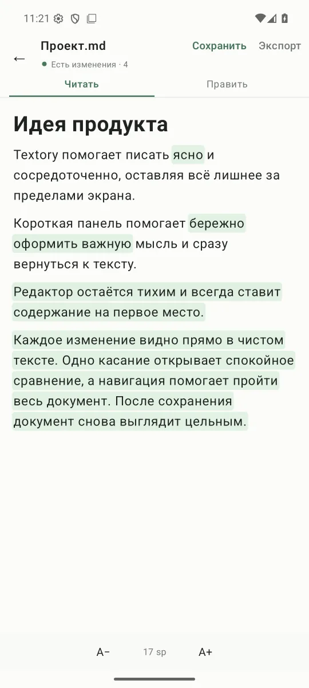
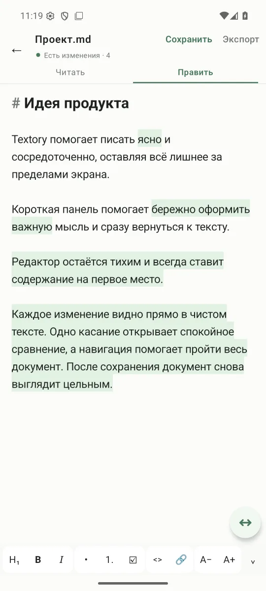
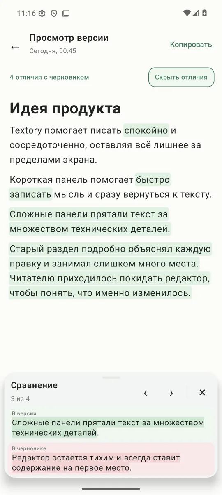

<p align="center">
  
</p>

<h1 align="center">Textory</h1>

<p align="center">
  Спокойный Markdown-редактор для Android с наглядным diff и локальной историей версий.
</p>

<p align="center">
  <a href="https://github.com/Krablante/textory/releases/latest"></a>
  
  <a href="LICENSE"></a>
</p>

<p align="center">
  <a href="https://github.com/Krablante/textory/releases/latest"><strong>Скачать последнюю версию</strong></a>
</p>

Textory хранит независимые Markdown-документы прямо на устройстве. Он не требует аккаунта, backend или Git и показывает изменения там, где вы пишете и читаете текст — без отдельного технического экрана.

## Как выглядит

<table>
  <tr>
    <td align="center" width="50%">
      <br>
      <strong>Чтение и живой diff</strong><br>
      <sub>Чистый Markdown-rendering, выделение и сравнение с последним сохранением.</sub>
    </td>
    <td align="center" width="50%">
      <br>
      <strong>Компактный редактор</strong><br>
      <sub>Исходный Markdown, форматирование и сохранение без лишних панелей.</sub>
    </td>
  </tr>
  <tr>
    <td align="center" width="50%">
      <br>
      <strong>История против черновика</strong><br>
      <sub>Любой snapshot сравнивается с живым, включая несохранённый, текстом.</sub>
    </td>
    <td align="center" width="50%">
      <br>
      <strong>Сфокусированное сравнение</strong><br>
      <sub>Короткие правки рядом, длинные — полноширинно, без вложенной прокрутки.</sub>
    </td>
  </tr>
</table>

## Возможности

- создание, импорт, переименование и удаление независимых `.md`-документов;
- форматированный режим чтения и отдельная правка исходного Markdown;
- diff на уровнях абзаца, фразы и слова с компактной навигацией;
- локальный snapshot при каждом сохранении и восстановление выбранной версии в черновик;
- сравнение historical snapshot с текущим несохранённым текстом;
- экспорт копии и сохранение обратно в импортированный файл;
- нативное выделение всего документа и copy в plain text и HTML;
- светлая, мягкая тёмная и тёплая книжная `Sepia Paper` с локальным сохранением выбора;
- однократная тихая проверка GitHub Releases при холодном запуске и безопасный self-update.

## Приватность

Документы, черновики и история остаются в приватном хранилище приложения. Textory не содержит телеметрии, собственного backend или периодического polling. При холодном запуске выполняется максимум один маленький metadata-запрос к GitHub, если Android уже подтвердил доступ к интернету; APK никогда не скачивается без согласия пользователя. Облачный backup и широкий доступ к накопителю отключены.

## Установка

Откройте [последний stable release](https://github.com/Krablante/textory/releases/latest), скачайте `Textory-X.Y.Z.apk` и подтвердите установку Android. Все следующие версии можно устанавливать из самого Textory. Каждый APK проверяется по GitHub SHA-256, package name, возрастающему version code и опубликованному production-сертификату.

## Сборка

Требуются JDK 17 и Android SDK с API 37. Укажите SDK через Android Studio или стандартный `local.properties`, затем запустите:

```bash
./gradlew testDebugUnitTest lintDebug assembleDebug
```

Debug APK появится в `app/build/outputs/apk/debug/app-debug.apk`. Production signing не хранится в репозитории; его внешний контракт и release checklist описаны в [BUILDING.md](docs/BUILDING.md).

## Документация

- [UX-контракт](docs/UX.md) — пользовательское поведение и ключевые инварианты.
- [Архитектура](docs/ARCHITECTURE.md) — поток данных, хранение и границы компонентов.
- [Сборка и проверка](docs/BUILDING.md) — quality gate и release checklist.
- [Сторонние лицензии](docs/THIRD_PARTY_NOTICES.md) — runtime-зависимости и notices.

## Лицензия

Исходный код Textory распространяется по [MIT License](LICENSE).
